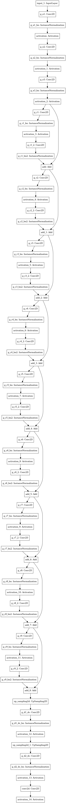

# U-Net-Flower-Image-Colorization
A small test using unet for colorization.

I used the almighty UNet and the theory of [this paper](https://arxiv.org/pdf/1603.08511.pdf) and [this one](https://arxiv.org/pdf/1811.03120.pdf) to estimate the color of B&W flower images.

I used (as the papers say) the LAB color space to estimate the A and B given L. My approax was a classification task, I quantizated the number of AB possible inputs to 40 (Special thanks to [foamliu](https://github.com/foamliu/Colorful-Image-Colorization/blob/master/demo.py)).

## Results

## My UNet

